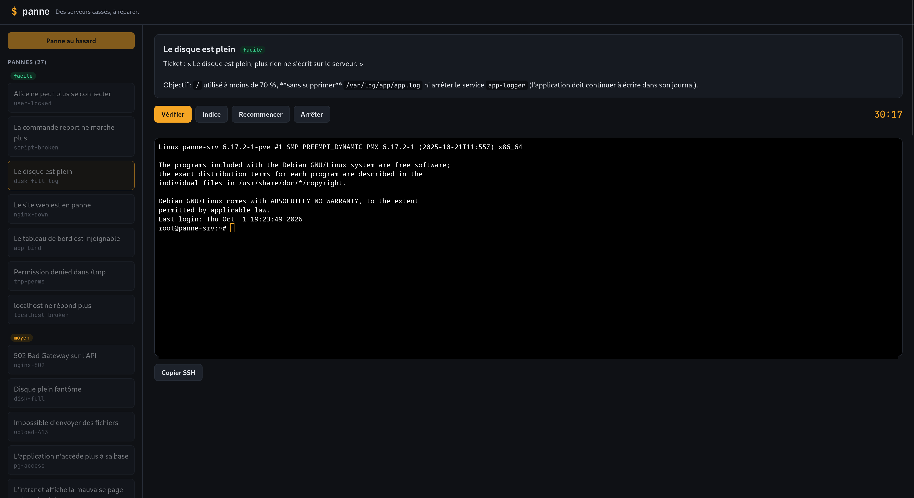

# proxmox-breakroom

Un labo de dépannage Linux façon [SadServers](https://sadservers.com), qui tourne chez soi sur Proxmox.

Le principe : on clique sur un scénario, un conteneur LXC neuf est créé **déjà cassé** (service en panne, disque plein, DNS faux…), et on le répare depuis un terminal dans le navigateur ou via ssh. Un bouton vérifie si c'est réglé.

J'ai créé ce projet pour m'entraîner au dépannage DevOps / cloud.



## Fonctionnalités

- **52 scénarios** : 33 pannes et 19 tâches, en 3 niveaux (facile, moyen, difficile)
- Pannes **aléatoires** : la plupart des scénarios ont plusieurs variantes
- Mode **« Panne au hasard »** : le titre reste caché jusqu'à la résolution
- **Scénarios multi-serveurs** : plusieurs conteneurs (ex. `web` + `db`), un onglet de terminal par machine
- **Scénarios conteneurs** : dépannage de services Podman (conteneur tombé, redémarrage en boucle, conteneuriser un service)
- **Sabotage** : sur certaines tâches, une fois le travail validé, le labo casse ce que je viens de construire — à réparer sur ma propre configuration
- **Filtre et stats par thème** (réseau, systemd, web…) pour repérer mes points faibles
- Terminal web, bouton **Vérifier**, chrono
- **Indices progressifs**, et la **solution** de référence en cas d'abandon
- **Historique et stats** : meilleurs temps, indices utilisés, dernières parties
- **Auto-test** chaque semaine : chaque variante de chaque scénario est cassée puis réparée automatiquement pour vérifier qu'elle fonctionne

## Fonctionnement

```
Navigateur ──► panne-web (Go) ──► API Proxmox : clone du modèle, démarrage, suppression
                      │
                      └────────► SSH vers le conteneur : panne, vérification, terminal
```

Chaque scénario se compose d'un énoncé, d'un script qui crée la panne, d'un script qui vérifie la réparation et d'indices. Les scénarios ne sont pas publiés dans ce dépôt, pour ne pas dévoiler les pannes.

## Rapports de dépannage

Après chaque scénario résolu, je rédige une fiche (cause, diagnostic, solution, notions apprises) dans [`docs/scenarios`](docs/scenarios/README.md).

## Sur mon Proxmox

| Élément | Rôle |
|---|---|
| **LXC 800 `panne-web`** | Héberge le site (binaire Go, service systemd) |
| **Modèle 900 `panne-base`** | Debian 12 prêt à l'emploi (Nginx, PostgreSQL, cron, SSH…) |
| **LXC 950 `panne-srv`** | Le serveur cassé : cloné depuis le modèle à chaque scénario, puis détruit |

Le site pilote Proxmox via un jeton API aux droits limités, et entre dans le conteneur cassé par SSH.

## Utilisation

1. Ouvrir `http://<IP de panne-web>:8080`
2. Choisir un scénario, ou cliquer sur **Panne au hasard**
3. Attendre ~30 s que le serveur soit créé et cassé
4. Réparer depuis le terminal de la page, ou avec **Copier SSH** depuis son propre terminal
5. Cliquer sur **Vérifier** : le chrono s'arrête si c'est résolu
6. **Indice** si on bloque (un à la fois), **Solution** si on abandonne, **Recommencer** pour repartir de zéro, **Arrêter** pour détruire le serveur